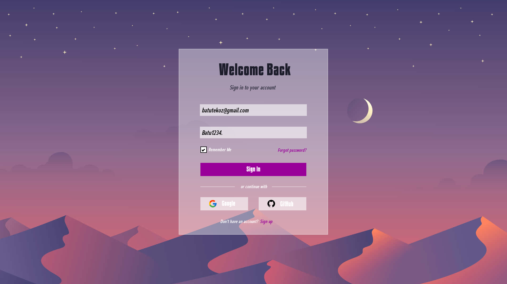
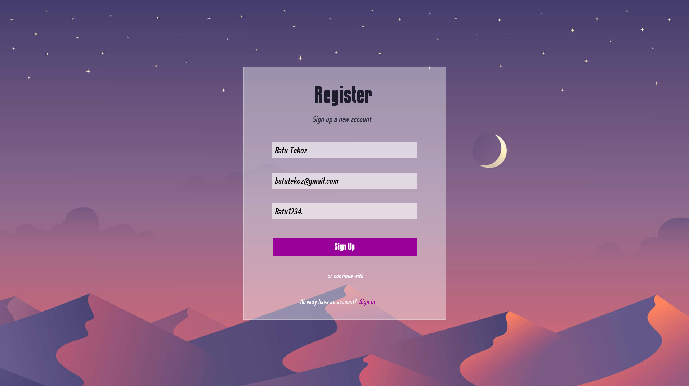
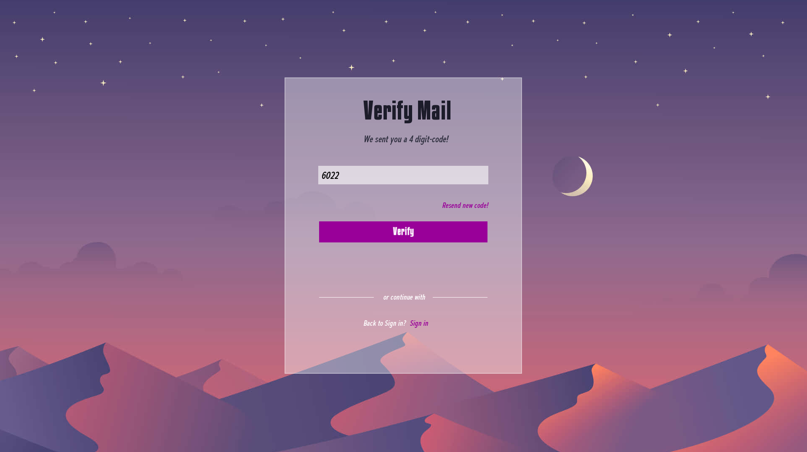
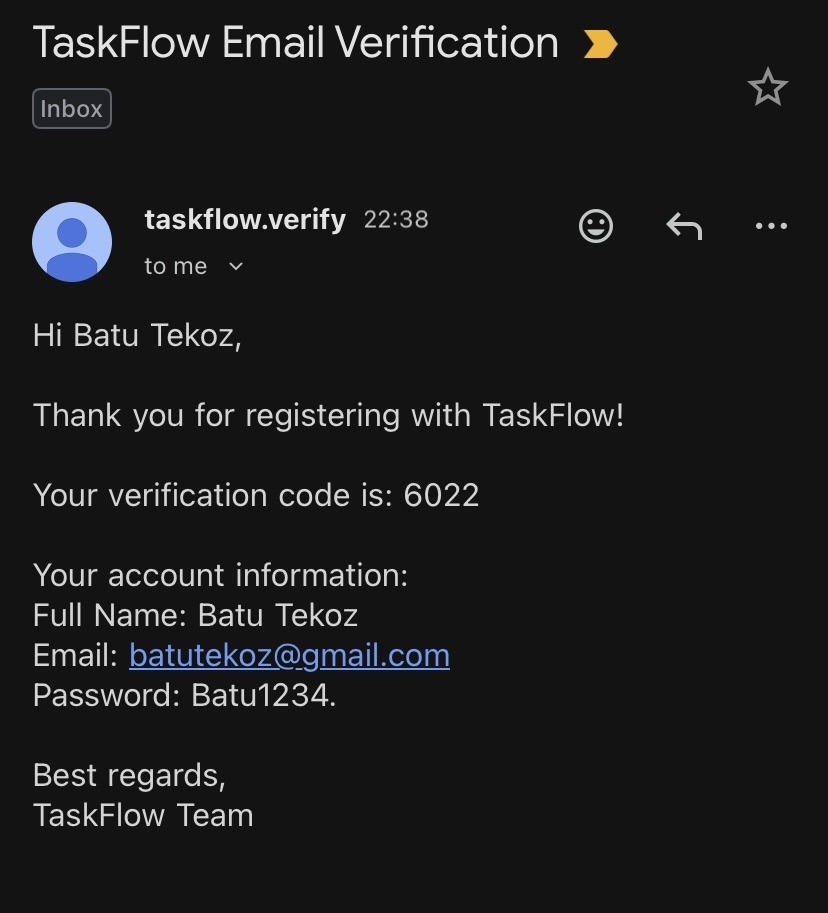
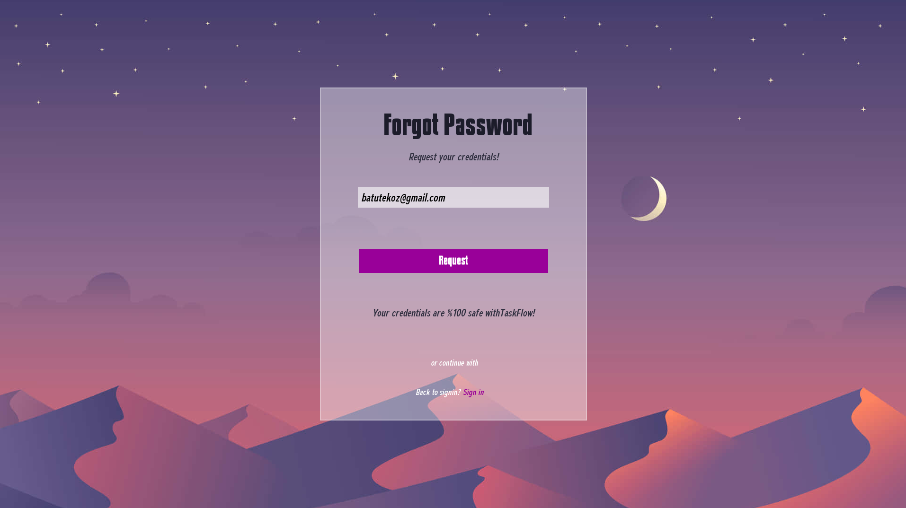
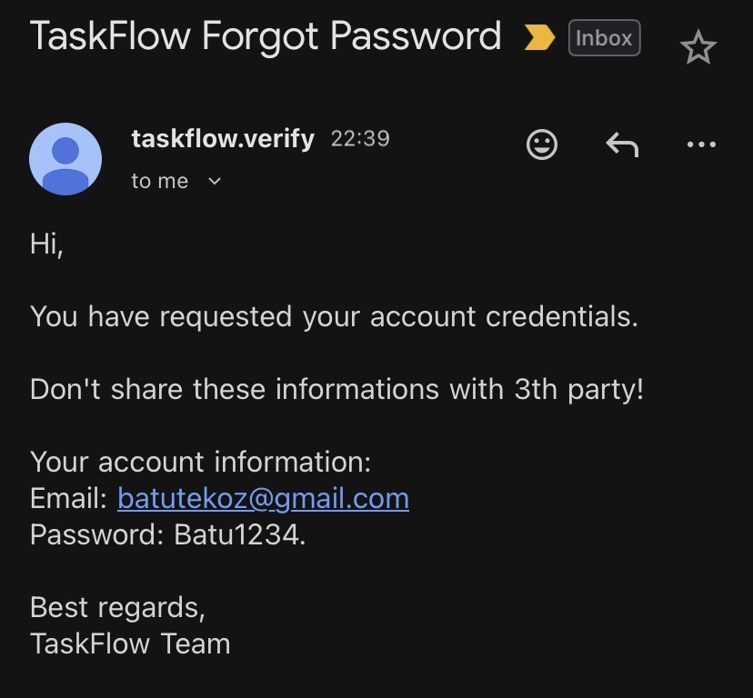

# TaskFlow
Taskflow is a Modern and Intuitive Task Assignment and Management Application in **modern C++23**.  
Easily distribute tasks among team members, track progress in real-time, and boost productivity. 
Simple, lightweight, and perfect for teams of any size.
%100 in C++ backend and frontend libraries.

---

## 🛠 Features  
- **Sign In**   
- **Sign Up**
- **E-Mail Verification**
- **Forgot Password**
- **Remember Me According to HWID Address**
- **Secured Databases which allowes to transfer data with each other**

---

## 🚀 Tech Stack  

- **Language:** C++23 (Visual Studio 2022 Community)  
- **UI Library:** [SFML BASE](https://www.sfml-dev.org/)  
- **Networking:** [SFML NETWORKING](https://www.sfml-dev.org/faq/networking/)  
- **Database:** SQLite (via SQLite Modern C++ wrapper)  
- **Compiler Standards:**  
  - C++23 (`/std:c++23preview`)  
  - C17 (`/std:c17`)  
  - Target: `x64/Release`

---

## 🎮 Roadmap  

- [x] Sign-in menu
- [x] Sign-up menu
- [x] E-Mail verification
- [x] Request credentials of account
- [x] Remember Me according to HWID Address of that computer

- [ ] Main menu
- [ ] Announcements menu
- [ ] Task Management menu
- [ ] Chat with AI menu
- [ ] Database management menu

- [x] Maximum 1 account with the same 'HWID' Address
- [x] Database 'password' hasher
- [ ] Networking 'rate/packet' limiters
- [ ] Extra 'firewall' to TCP port
- [x] Secured e-mail sender via Curl library

- [x] Label Widget
- [x] Button Widget
- [x] Button With Image Widget
- [x] Input Field Widget
- [x] Checkbox Widget
- [x] Custom Font Loader
 
--- 

## 📸 Screenshots

### Signin Menu


### Signup Menu


### E-mail Verification



### Forgot Password



---

## Getting Started

### 1. Install Git
Download and install Git:  
https://github.com/git-for-windows/git/releases/download/v2.50.1.windows.1/Git-2.50.1-64-bit.exe  

### 2. Setup VCPKG & Dependencies
Open **CMD** and run:
```
git clone https://github.com/microsoft/vcpkg.git
cd vcpkg
.bootstrap-vcpkg.bat
.vcpkg integrate install
.vcpkg install sfml:x64-windows
.vcpkg install sqlite-modern-cpp:x64-windows
.vcpkg install curl:x64-windows
```

### 3. Configure in Visual Studio
- Go to Project → Properties  
- Select Configuration Properties → vcpkg  
- Set Use Vcpkg to "Yes"  

## Building the Game
1. Open the project in **Visual Studio Community**  
2. Build the solution (`Ctrl + Shift + B`)  
3. Run the executables from (`x64/Release`)
4. `Server.exe` and then `Client.exe`

## License
This project is licensed under the **MIT License** – see the LICENSE file for details.  

## Contributing
Pull requests are welcome! Feel free to open issues for bugs, feature requests, or ideas.  

## Credits
- C++ – Project language  
- MySQL – High-optimised database library
- SFML Networking – Low-level networking library  
- SFML Base - User Interface library
- Curl SMTP Method – Sending e-mails to users
